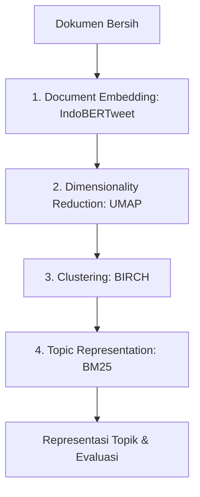

# Implementasi dan Evaluasi Model BERTopic Modifikasi

Dokumen ini mendokumentasikan detail implementasi dan evaluasi model *topic modeling* menggunakan *pipeline* BERTopic yang dimodifikasi berdasarkan Bab 2 (Tinjauan Pustaka) dan Bab 3 (Metodologi Penelitian) dari draft skripsi.

---

## 1. Alur Praproses Data (*Data Preprocessing*)

Sebelum data percakapan masuk ke dalam model, data mentah dibersihkan dan disiapkan melalui tahapan berikut untuk meminimalkan *noise* dan mempertahankan informasi semantik:

1. **Pemfilteran Pesan Sistem:** Menghapus pesan sistem bawaan dari ekspor WhatsApp (misalnya, notifikasi bergabung/keluar grup, perubahan setelan keamanan, pesan media/gambar/stiker).
2. **Anonimisasi Mention:** Mengganti penyebutan nama pengguna (*mention*) dengan token `@USER`.
3. **Penyaringan Panjang Pesan:** Menghapus pesan yang memiliki jumlah kata kurang dari 2 untuk menyaring pesan yang terlalu pendek dan minim informasi semantik.
4. **Penghapusan URL:** Menghapus tautan atau URL karena tidak memberikan kontribusi langsung terhadap representasi topik.
5. **Normalisasi Teks:**
   - Mengubah teks menjadi huruf kecil (*lowercase*).
   - Menormalisasi kata tawa (seperti *wkwk*, *haha*) menjadi token seragam.
   - Menghapus spasi ganda.
   - Menormalisasi pemanjangan karakter (*elongation*) pada kata (misalnya, "iyaaaa" menjadi "iya").
6. **Transliterasi Emoji:** Mengubah emoji dan emotikon ke dalam representasi teks agar makna ekspresif di dalamnya tetap tertangkap secara semantik.

---

## 2. Arsitektur Pipeline BERTopic Modifikasi

Model yang dibangun didasarkan pada kerangka kerja BERTopic dengan melakukan modifikasi pada beberapa komponen utamanya untuk menyesuaikan dengan karakteristik data percakapan grup WhatsApp (teks pendek, informal, dan *noisy*).

### Tahap 1: Document Embedding (IndoBERTweet)
Mengubah setiap dokumen (pesan WhatsApp yang telah melewati praproses) menjadi representasi vektor numerik berdimensi tinggi. 
- **Model yang digunakan:** `IndoBERTweet` (model bahasa pra-latih berskala besar yang dikembangkan khusus untuk variasi bahasa Indonesia informal di media sosial).
- **Justifikasi:** Memiliki kosakata domain-spesifik (14.584 kosakata baru atau sekitar 46% dari total kosakata baru dibanding IndoBERT biasa) yang cocok dengan karakteristik bahasa tidak terstruktur pada percakapan grup WhatsApp.

### Tahap 2: Dimensionality Reduction (UMAP)
Mereduksi dimensi vektor embedding untuk mengurangi kompleksitas komputasi klasterisasi tanpa menghilangkan hubungan spasial dan struktural (lokal maupun global) antar-vektor.
- **Parameter Kunci:** `n_neighbors`, `n_components`, `min_dist`, dan `metric`.

### Tahap 3: Clustering (BIRCH)
Mengelompokkan dokumen ke dalam klaster berdasarkan kemiripan semantik. BIRCH (*Balanced Iterative Reducing and Clustering using Hierarchies*) digunakan sebagai pengganti algoritma *default* (HDBSCAN).
- **Justifikasi:** Mampu mengalokasikan seluruh dokumen ke dalam klaster secara efisien tanpa menyisakan *outlier* dalam jumlah besar yang biasa terjadi pada HDBSCAN, serta memiliki efisiensi memori yang baik.
- **Rumus-rumus Matematis BIRCH:**

  1. **Clustering Feature (CF):**
     Ringkasan subklaster disimpan dalam bentuk CF yang didefinisikan sebagai:
     $$CF = (N, LS, SS)$$
     *   $N$: Jumlah titik data dalam subklaster.
     *   $LS$: Jumlah linear dari titik-titik data, yaitu:
         $$LS = \sum_{i=1}^{N} x_i$$
     *   $SS$: Jumlah kuadrat dari titik-titik data, yaitu:
         $$SS = \sum_{i=1}^{N} \lVert x_i \rVert^2$$

  2. **Centroid ($\mu$):**
     Titik pusat subklaster dihitung sebagai:
     $$\mu = \frac{LS}{N}$$

  3. **Radius Subklaster ($R$):**
     Radius digunakan untuk mengukur kerapatan subklaster dan mendeteksi pencilan (*outlier*):
     $$R = \sqrt{\frac{SS}{N} - \left\lVert \frac{LS}{N} \right\rVert^2}$$

  4. **Pembaruan Radius ($R'$) saat Penambahan Data Baru ($x$):**
     Ketika titik baru $x$ dimasukkan ke dalam subklaster, radius baru dihitung dengan memanfaatkan prinsip aditivitas CF:
     $$R' = \sqrt{\frac{SS + \lVert x \rVert^2}{N+1} - \left\lVert \frac{LS + x}{N+1} \right\rVert^2}$$
     *   Kondisi pemisahan/penggabungan node dalam CF-Tree bergantung pada apakah $R' \le T$ (di mana $T$ adalah parameter *threshold* kekompakan subklaster).
     *   Parameter penting lainnya adalah *branching factor* ($B$) yang mengontrol jumlah maksimum anak pada tiap node CF-Tree.

### Tahap 4: Topic Representation (BM25)
Mengekstrak kata kunci yang paling representatif dari setiap klaster dokumen yang terbentuk. Skema pembobotan BM25 digunakan sebagai pengganti kelas TF-IDF (c-TF-IDF) bawaan BERTopic.
- **Justifikasi:** BM25 menerapkan saturasi frekuensi kata dan normalisasi panjang dokumen sehingga representasi topik yang dihasilkan lebih stabil dan tidak didominasi secara timpang oleh kata-kata yang sering berulang pada dokumen panjang.
- **Rumus Matematis BM25 pada Level Klaster:**
  Bobot kata $t$ pada klaster $c_k$ dihitung dengan menjumlahkan kontribusi seluruh dokumen $d$ yang menjadi anggota dari klaster tersebut ($C_k$):
  $$w_{t,c_k} = \sum_{d \in C_k} IDF(t) \cdot \frac{f(t,d)(k_1 + 1)}{f(t,d) + k_1 \left(1 - b + b \cdot \frac{|d|}{avgdl}\right)}$$

  Dimana fungsi *Inverse Document Frequency* ($IDF$) didefinisikan sebagai:
  $$IDF(t) = \log \left( \frac{N - n(t) + 0.5}{n(t) + 0.5} \right)$$

  *   $f(t,d)$: Frekuensi kemunculan kata $t$ di dalam dokumen $d$.
  *   $|d|$: Panjang dokumen $d$ (jumlah kata).
  *   $avgdl$: Rata-rata panjang dokumen di dalam seluruh korpus.
  *   $n(t)$: Jumlah dokumen dalam korpus yang memuat kata $t$.
  *   $N$: Jumlah total dokumen dalam korpus.
  *   $k_1$: Parameter saturasi frekuensi istilah (mengontrol pengaruh pengulangan kata).
  *   $b$: Parameter normalisasi panjang dokumen (mengontrol hukuman untuk dokumen panjang).

---

## 3. Metrik Evaluasi Model

Evaluasi model dilakukan secara kuantitatif dengan menggabungkan evaluasi berbasis leksikal (representasi kata kunci) dan evaluasi berbasis semantik (pada ruang representasi vektor embedding).

### A. Evaluasi Berbasis Leksikal (Representasi Kata)

#### 1. Topic Coherence (NPMI)
Mengukur keterkaitan semantik antar-kata kunci teratas dalam suatu topik berdasarkan probabilitas ko-okurensi kata pada korpus referensi. Metode NPMI (*Normalized Pointwise Mutual Information*) dipilih karena memiliki korelasi tertinggi dengan penilaian manusia.
- **Rumus NPMI:**
  $$\text{NPMI}(w_i, w_j) = \frac{\log \dfrac{P(w_i, w_j)}{P(w_i) \cdot P(w_j)}}{-\log P(w_i, w_j)}$$
  *   $P(w_i, w_j)$: Probabilitas kemunculan bersama (ko-okurensi) kata $w_i$ dan $w_j$.
  *   $P(w_i), P(w_j)$: Probabilitas marjinal kemunculan kata $w_i$ dan $w_j$ secara individual.
  *   *Rentang Nilai:* $[-1, 1]$, di mana nilai $1$ menunjukkan keterkaitan semantik sempurna, $0$ tidak ada keterkaitan, dan nilai negatif menyatakan hubungan yang berlawanan.

#### 2. Topic Diversity (TD)
Mengukur tingkat keberagaman topik yang dihasilkan dengan menghitung persentase kata unik dari kumpulan kata kunci teratas di semua topik.
- **Rumus Topic Diversity:**
  $$TD = \frac{|\text{unique words in top } N \text{ words of all topics}|}{N \times K}$$
  *   $N$: Jumlah kata teratas yang dianalisis per topik (umumnya $N = 25$).
  *   $K$: Jumlah total topik yang dihasilkan.
  *   *Interpretasi:* Nilai mendekati 0 menunjukkan topik yang redundan (banyak kata kunci sama berulang di berbagai topik), sedangkan nilai mendekati 1 menunjukkan keberagaman topik yang tinggi.

---

### B. Evaluasi Berbasis Semantik (Ruang Embedding)

#### 1. Embedding Density (Kepadatan Embedding)
Mengukur kepadatan spasial representasi dokumen di sekitar centroid klaster dengan menggabungkan jarak spasial (fungsi kernel Gaussian) dan bobot relevansi semantik dokumen terhadap topik.
- **Rumus Embedding Density ($\rho_k$) untuk Topik $k$:**
  $$\rho_k = \frac{\sum_{i=1}^{N_k} k\!\left(\frac{\bar{\mathbf{e}}_k - \mathbf{e}_i}{h}\right) w_{k,i}}{\sum_{i=1}^{N_k} k\!\left(\frac{\bar{\mathbf{e}}_k - \mathbf{e}_i}{h}\right)}$$
  *   $\bar{\mathbf{e}}_k$: Vektor *centroid* topik ke-$k$ (rata-rata embedding dokumen dalam klaster $k$).
  *   $\mathbf{e}_i$: Vektor embedding dokumen ke-$i$ dalam klaster $k$.
  *   $k(y)$: Fungsi kernel Gaussian sebagai pengukur kedekatan spasial:
      $$k(y) = (2\pi)^{-d/2} \exp\left(-\frac{|y|^2}{2}\right)$$
  *   $h$: Parameter *bandwidth*. Estimasi berbasis volume ($h_V$) menggunakan kuantil radius 0.1 dan 0.9 digunakan untuk meminimalkan dampak *outlier*, dengan mekanisme *fallback* Silverman.
  *   $w_{k,i}$: Bobot semantik dokumen ke-$i$ terhadap topik $k$. Diambil dari normalisasi skor representasi kata-kata topik (BM25) yang muncul pada dokumen tersebut ke rentang $[0,1]$.
  *   *Penyebut:* Berfungsi sebagai konstanta normalisasi agar skor kepadatan tidak bias terhadap jumlah dokumen dalam klaster.

#### 2. Intra-topic Similarity (ITS)
Mengukur kekohesifan dokumen di dalam satu topik dengan merata-ratakan kemiripan kosinus (*cosine similarity*) berpasangan (*pairwise similarity*) antar-dokumen.
- **Rumus Intra-topic Similarity untuk Topik $k$:**
  $$\text{ITS}(k) = \frac{1}{N_k(N_k - 1)} \sum_{\substack{i,j=1 \\ i \neq j}}^{N_k} \cos\!\left(\mathbf{e}_i^{(k)},\, \mathbf{e}_j^{(k)}\right)$$
  *   $\mathbf{e}_i^{(k)}, \mathbf{e}_j^{(k)}$: Representasi vektor embedding dokumen ke-$i$ dan ke-$j$ pada topik $k$.
  *   $N_k$: Jumlah dokumen dalam topik $k$.
  *   *Nilai Akhir:* Diperoleh dengan merata-ratakan nilai $\text{ITS}(k)$ untuk seluruh $K$ topik. Nilai yang lebih tinggi menunjukkan klaster dokumen yang lebih kohesif dan terfokus secara semantik.

---

## 4. Eksperimen dan Validasi (Skenario Pengujian)

Untuk mengukur performa dan kestabilan model seiring perubahan volume data, evaluasi dilakukan menggunakan skenario berikut:
- **Eksperimen Learning Curve:** Keempat metrik di atas dihitung pada lima proporsi data uji yang berbeda:
  $$\text{Proporsi Data} \in \{20\%, 40\%, 60\%, 80\%, 100\%\}$$
- **Pembandingan Baseline:** Hasil evaluasi pipeline modifikasi (IndoBERTweet + UMAP + BIRCH + BM25) dibandingkan dengan:
  1. *Baseline BERTopic Default* (all-MiniLM-L6-v2 + UMAP + HDBSCAN + c-TF-IDF).
  2. Kombinasi silang alternatif komponen, seperti pengaruh penggantian model *embedding* (IndoBERTweet vs all-MiniLM-L6-v2) dan algoritma klasterisasi (BIRCH vs HDBSCAN).
